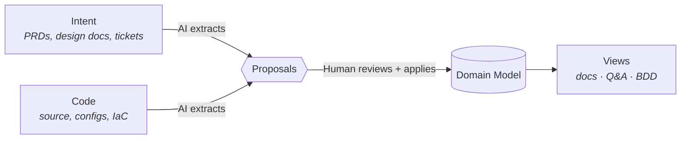

# Braid

[](https://github.com/mroops0111/braid/actions/workflows/ci.yml)
[](LICENSE)
[](https://nodejs.org)
[](https://www.typescriptlang.org)

**A shared model of your business, not another code graph.** Code is what shipped. Intent is what we meant. They drift apart every sprint and the team ends up arguing about which one is right.

Braid _braids_ them back into a single **domain model that engineers and PMs can both read**. The default ontology is Domain-Driven Design, so the team and the AI both talk in the language of the domain instead of class names and package paths.

```bash
pnpm dlx @braidhq/cli init my-product
cd my-product && pnpm dlx @braidhq/cli dev
# Studio at http://localhost:5173, server at :4321
```

- **Retrofit, don't rewrite.** Braid runs on the legacy you already have. It extracts a model from what's actually shipped, not from a green-field spec the team has to commit to first. No prerequisite refactor, no spec-driven migration.
- **Iterates with your codebase.** The model is not a one-shot snapshot. Each time code or intent changes, AI re-extracts the diff as a new Proposal for review. The loop is built to ride along with PRs.
- **Humans gate every write.** AI proposes, a person reviews the diff and approves, then it lands. Nothing reaches the model otherwise. No silent writes, no AI-on-AI feedback loops.
- **One model, many views.** The graph is the intermediate, not the product. Docs, Q&A, and BDD specs are all projections off the same canonical model, so they can't drift from each other.
- **Reaches the whole team, not just engineers.** PMs, designers, QA, and support ask the model from a browser or Slack with no install. Engineers reach it via CLI or any MCP client (Cursor, Claude Code, Codex).

---

## Why this exists

Two failure modes Braid is built against.

1. **Code-only graphs.** Tools like Graphify and GitNexus pull a graph straight from source. The graph is honest about what runs, but it is a class-and-call-site graph. It can't tell you *why* a feature exists, who asked for it, or what trade-off shaped its rules. PMs can't read it.
2. **Doc-only knowledge.** PRDs, design docs, Notion, Confluence speak the domain, but nobody keeps them in sync after the code lands. Six months later, no one trusts them.

Braid is a framework, not a managed service. Bring your own ontology, LLM backend, storage, and source connectors. The HITL gate, evidence requirement, and branded type discipline are framework invariants enforced by the type system.

## How It Works



## Quick Start

Once `braid dev` is running, work the loop in Studio (`http://localhost:5173`):

1. **Skills** tab. Run `/ddd:extract`.
2. **Proposals** tab. Inspect each diff, click pre-validate.
3. **Apply** when green, or **Reject** with a reason.

Workspace shape lives in one `PRODUCT.md` manifest. The minimum is just sources:

```yaml
---
name: my-product
sources:
  - {kind: filesystem, role: intent, path: ./intent}
  - {kind: filesystem, role: code, path: ./code/app, language: typescript}
---
```

Defaults fill in the rest: DDD ontology, Claude Code agent (opus), embedded Kuzu storage. Declare `ontologyId`, `agents` + `agentBindings`, or `storage` blocks only when you want to override. Swap `kind: filesystem` for `git` or `gdrive` to load remote sources.

## Packages

| Package | Description |
|---|---|
| [`@braidhq/schema`](packages/schema/) | Zod schemas and branded TypeScript types for the domain. The wire-format contract for all packages. |
| [`@braidhq/core`](packages/core/) | Domain entities, application services, and plugin port interfaces. The framework engine; no concrete adapters. |
| [`@braidhq/sdk`](packages/sdk/) | Plugin author SDK, used to define ontology, source loader, and view generator plugins. |
| [`@braidhq/server`](packages/server/) | REST + SSE server. |
| [`@braidhq/cli`](packages/cli/) | Command-line entry point. |
| [`@braidhq/studio`](packages/studio/) | Web UI. |
| [`@braidhq/ontology-ddd`](packages/ontology-ddd/) | Default DDD ontology plugin, including boundedContext, aggregate, command, query, event, rule, and actor. |
| [`@braidhq/storage-kuzu`](packages/storage-kuzu/) | Embedded Kuzu graph-storage plugin. Zero-infra single-binary alternative to Neo4j. |
| [`@braidhq/source-loader-git`](packages/source-loader-git/) | Git source-loader plugin. Clone a repo and sync automatically. |
| [`@braidhq/source-loader-gdrive`](packages/source-loader-gdrive/) | Google Drive source-loader plugin. Export docs from Google Drive, requires OAuth on first use. |
| [`@braidhq/agent-claude-code`](packages/agent-claude-code/) | Claude Code agent plugin. Spawns the `claude` CLI to run SKILL.md prompts; the default LLM backend. |
| [`@braidhq/desktop`](packages/desktop/) | Tauri desktop shell. |

Adding a plugin (e.g., `@braidhq/my-coding-agent`) means one new package implementing the relevant port. No core changes.

## Extending Braid

Two extension surfaces: a TypeScript plugin for the five swappable axes (ontology, source loader, storage, agent, view generator) and a markdown skill for new AI capabilities.

### Writing a plugin

Storage, agent, and view-generator implement their port interface directly. Ontology and source-loader get a more declarative SDK builder.

```ts
// @somecorp/braid-storage-mygraph
import type { StoragePlugin } from '@braidhq/core'
import { z } from 'zod'

export const myStoragePlugin: StoragePlugin = {
  id: 'storage.mygraph',
  type: 'storage',
  kind: 'mygraph',
  configSchema: z.object({ uri: z.string() }),
  createModelRepository: async (descriptor, ctx) =>
    new MyGraphRepository(descriptor.config, ctx.resolveWorkspaceRoot),
}
```

Register it at server start-up and flip the workspace's `storage.kind`.

```ts
import { composeFsApp, createApp } from '@braidhq/server'
import { myStoragePlugin } from '@somecorp/braid-storage-mygraph'

createApp(await composeFsApp({
  extraStoragePlugins: [myStoragePlugin],
  storageKind: 'mygraph',
}))
```

### Writing a custom skill

A skill is a `SKILL.md` file at `<workspace>/skills/<verb>/SKILL.md`, and it invokes as `/workspace:<verb>`. The framework picks it up on the next request and it shows up in Studio's Skills tab alongside the built-ins.

```markdown
---
name: quick-extract
description: Extract DDD entities from intent + code
argumentHint: <ctx-name>
model: opus
braid:
  requiredEnv: [GITHUB_TOKEN]
  requiredPaths: [./intent, ./code]
---
Walk `intent/` and `code/`. Emit proposals that add boundedContext, aggregate, and command nodes. Cite the source file or doc each claim came from.
```

Top-level keys follow the Claude Code skill frontmatter format (`name`, `description`, `argumentHint`, `model`). The Braid-specific `braid:` block is preflighted before the agent spawns, so a missing env var, path, or MCP server fails fast with a clear error instead of derailing the conversation halfway through.

## License

[MIT](LICENSE)
