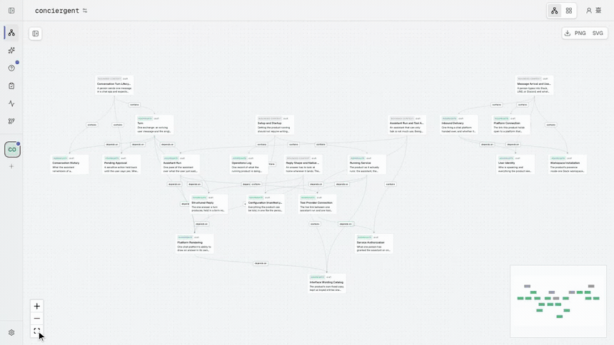

# Braid

[](https://github.com/mroops0111/braid/actions/workflows/ci.yml)
[](LICENSE)
[](https://nodejs.org)
[](https://www.typescriptlang.org)

_A harness framework that keeps AI and your team building one domain model together, in a loop where the AI drafts and asks, and people decide._



**A shared model of your business, not another code graph.** Code is what shipped. Intent is what the team meant. They drift apart every sprint, and the team ends up arguing about which one is right.

Braid _braids_ them back into one domain model that engineers and PMs can both read. The default ontology is Domain-Driven Design (DDD), so people and the AI both speak the ubiquitous language of the domain instead of class names and package paths.

## Features

- **Human-in-the-Loop Gate**: the AI drafts and asks, but a person decides before any change lands.
- **Evidence-Backed Claims**: every node traces back to the file or document it was drawn from.
- **Docs That Never Drift**: a document is a projection of the one model, regenerated on demand rather than kept in sync by hand.
- **Continuous Reaction**: as sources change, Braid feeds the diff back as a fresh Proposal instead of going stale.
- **Git-Versioned History**: every human-gated write commits to Git, so any point in the model's history is restorable.

## Motivation

Braid is built against two failure modes.

- **Code-Only Graphs**: tools that pull a graph straight from source are honest about what runs, but the result is a class-and-call-site graph. It cannot tell you why a feature exists, who asked for it, or what trade-off shaped its rules. PMs cannot read it.
- **Doc-Only Knowledge**: PRDs, design docs, Notion, and Confluence speak the domain, but nobody keeps them in sync once the code lands. Several months later, nobody trusts them.

## Design

Braid is a pluggable framework over a fixed runtime shape. The axes are swappable, the review loop and the human gate are not.

### Framework

Every axis is a plugin, and the defaults are a starting point rather than a built-in assumption.

- **Swappable Axes**: the ontology, source loaders, storage, agent, and view generators are all plugins, each overridable in one manifest field.
- **Framework Invariants**: the human-in-the-loop gate, the evidence requirement, and the branded type discipline are enforced by the type system and cannot be swapped out.
- **Braid Anything**: the domain lives in the ontology, not the engine, so the same loop, gate, and provenance carry over whether you braid a codebase, a research corpus, or a product spec.

### Architecture

The server is the composition root. Sources feed an event-driven engine that produces reviewable changes, a human gate lands them in one canonical model, and every write is versioned in Git.


- **Surfaces**: Studio (web UI), Desktop, CLI, and MCP clients all talk to one server over REST and SSE.
- **Sources**: Intent (PRDs, RFCs, issues) and Code (repositories) are pulled in by Source Loader plugins for git, github, and gdrive.
- **Engine (The HITL Loop)**: the Agent runs Skills as subprocesses. Skills analyze the sources and generate two human-in-the-loop artifacts, a Proposal (a proposed change to the model) and a Clarification (a question to resolve ambiguity).
- **Model**: an Ontology types the graph, the Graph is the single source of truth, and a Storage plugin such as Kuzu persists it.
- **Reads**: Ask answers a one-off question over the graph, and View Generators project docs and other Views off it.
- **History**: every human-gated write commits to Git. The graph state travels alongside the code as a `model.json` snapshot, so any commit is restorable.

## Usage

Get a workspace running, then work the review loop in Studio.

### Quick Start

Braid runs from the monorepo today. Clone it, install, and start the dev stack.

```bash
git clone https://github.com/mroops0111/braid
cd braid && pnpm install && pnpm dev
# Studio at http://localhost:5173, server at :4321
```

Open Studio and create a workspace with the Wizard, then add your intent and code sources. The default ontology is DDD.

### The Loop

Once the dev server is running, work the loop in Studio at `http://localhost:5173`.

- **Extract**: run a skill such as `/ddd:extract` from the Actions tab.
- **Review**: open each Proposal, inspect the diff, and pre-validate it. Answer any Clarification the agent raised.
- **Apply**: land the change when it is green, or reject it with a reason.

## Packages

**Framework Core**

| Package | Description |
|---|---|
| [`@braidhq/schema`](packages/schema/) | Zod schemas and branded types. The wire-format contract for every package. |
| [`@braidhq/core`](packages/core/) | Domain entities, application services, and plugin port interfaces, with no concrete adapters. |
| [`@braidhq/sdk`](packages/sdk/) | Author SDK for ontology, source loader, and view generator plugins. |

**Plugins**

| Package | Description |
|---|---|
| [`@braidhq/ontology-ddd`](packages/ontology-ddd/) | Default DDD ontology: boundedContext, aggregate, command, query, event, rule, and actor. |
| [`@braidhq/storage-kuzu`](packages/storage-kuzu/) | Embedded Kuzu graph store, a zero-infra single-binary alternative to Neo4j. |
| [`@braidhq/source-loader-git`](packages/source-loader-git/) | Clone a repository and sync it automatically. |
| [`@braidhq/source-loader-github`](packages/source-loader-github/) | Sync a GitHub repository over the API, OAuth on first use. |
| [`@braidhq/source-loader-gdrive`](packages/source-loader-gdrive/) | Export documents from Google Drive, OAuth on first use. |
| [`@braidhq/agent-claude-code`](packages/agent-claude-code/) | Runs the `claude` CLI to execute SKILL.md prompts, the default LLM backend. |

**Surfaces**

| Package | Description |
|---|---|
| [`@braidhq/server`](packages/server/) | REST and SSE server, the composition root. |
| [`@braidhq/cli`](packages/cli/) | Command-line entry point. |
| [`@braidhq/studio`](packages/studio/) | Web UI. |
| [`@braidhq/desktop`](packages/desktop/) | Tauri desktop shell. |

## Extending Braid

Braid has two extension surfaces, and neither touches the core. A TypeScript plugin adds a swappable axis. A Markdown skill adds an AI capability.

A plugin implements a port and registers at server start-up, then a workspace opts in by name. See [`@braidhq/sdk`](packages/sdk/) for the ontology and source-loader builders. The shipped plugins, such as [`@braidhq/storage-kuzu`](packages/storage-kuzu/) and [`@braidhq/source-loader-git`](packages/source-loader-git/), are reference implementations to copy from.

A skill is a `SKILL.md` file at `<workspace>/skills/<verb>/SKILL.md`, invoked as `/workspace:<verb>`. It shows up in Studio's Actions tab alongside the built-ins on the next request.

```markdown
---
name: quick-extract
description: Extract DDD entities from intent + code
argumentHint: <ctx-name>
model: opus
braid:
  requiredEnv: [GITHUB_TOKEN]
---
Walk `intent/` and `code/`. Emit proposals that add boundedContext, aggregate, and command nodes. Cite the source file or doc each claim came from.
```

The `braid:` block is preflighted before the agent spawns, so a missing env var or MCP server fails fast with a clear error.

## License

[MIT](LICENSE)
