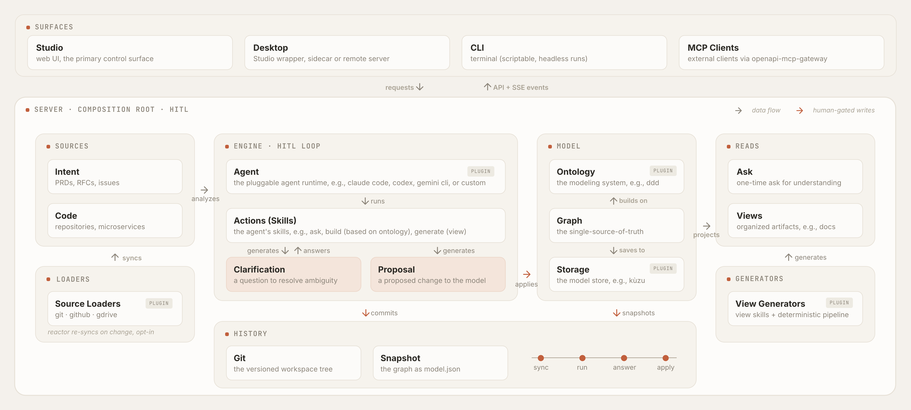

# Braid

[](https://github.com/mroops0111/braid/actions/workflows/ci.yml)
[](LICENSE)
[](https://nodejs.org)
[](https://www.typescriptlang.org)

**A shared model of your business, not another code graph.** Code is what shipped. Intent is what the team meant. They drift apart every sprint, and the team ends up arguing about which one is right.

Braid braids them back into one domain model that engineers and PMs can both read. The default ontology is Domain-Driven Design (DDD), so people and the AI both speak the ubiquitous language of the domain instead of class names and package paths.



## Features

Braid keeps one human-gated domain model, built from your sources and reviewed before any change lands.

- **Canonical Model**: the model is the one artifact everything else derives from. Docs and other views are projections off it rather than parallel copies, so the team reasons about a single shared source of truth instead of reconciling many.
- **Pluggable Ontology**: an ontology gives the model its types, so it reads as a domain rather than a call graph. The ontology is itself a plugin, so the default is a starting point you can replace.
- **Human-in-the-Loop Gate**: an AI-built model will not always match how each expert sees the domain, so every disagreement is settled by a person before it lands. The AI drafts, but it is never the final authority on the model.
- **Continuous Reaction**: the model is not a one-shot build. As sources change, Braid reacts and feeds the diff back as a fresh Proposal, so the model keeps pace instead of going stale.
- **Evidence-Backed Claims**: each node carries a reference to the source it was drawn from, so a claim can be traced back rather than taken on trust.

## Motivation

Braid is built against two failure modes.

- **Code-Only Graphs**: tools that pull a graph straight from source are honest about what runs, but the result is a class-and-call-site graph. It cannot tell you why a feature exists, who asked for it, or what trade-off shaped its rules. PMs cannot read it.
- **Doc-Only Knowledge**: PRDs, design docs, Notion, and Confluence speak the domain, but nobody keeps them in sync once the code lands. Six months later, nobody trusts them.

## Framework

Braid is a framework, not a managed service. Every axis is a plugin, and the defaults are a starting point rather than a built-in assumption.

- **Swappable Axes**: the ontology, source loaders, storage, agent, and view generators are all plugins, each overridable in one manifest field.
- **Framework Invariants**: the human-in-the-loop gate, the evidence requirement, and the branded type discipline are enforced by the type system and cannot be swapped out.
- **Braid Anything**: the domain lives in the ontology, not the engine, so the same loop, gate, and provenance carry over whether you braid a codebase or a research corpus.

## Architecture

The server is the composition root. Sources feed an event-driven engine that produces reviewable changes, a human gate lands them in one canonical model, and every write is versioned in Git.

- **Surfaces**: Studio (web UI), Desktop, CLI, and MCP clients all talk to one server over REST and SSE.
- **Sources**: Intent (PRDs, RFCs, issues) and Code (repositories) are pulled in by Source Loader plugins for git, github, and gdrive.
- **Engine (The HITL Loop)**: the Agent runs Skills as subprocesses. Skills analyze the sources and generate two human-in-the-loop artifacts, a Proposal (a proposed change to the model) and a Clarification (a question to resolve ambiguity).
- **Model**: an Ontology types the graph, the Graph is the single source of truth, and a Storage plugin such as Kuzu persists it.
- **Reads**: Ask answers a one-off question over the graph, and View Generators project docs and other Views off it.
- **History**: every human-gated write commits to Git. The graph state travels alongside the code as a `model.json` snapshot, so any commit is restorable.

## Quick Start

Scaffold a workspace and start the dev server.

```bash
pnpm dlx @braidhq/cli init my-product
cd my-product && pnpm dlx @braidhq/cli dev
# Studio at http://localhost:5173, server at :4321
```

## The Loop

Once `braid dev` is running, work the loop in Studio at `http://localhost:5173`.

- **Extract**: run a skill such as `/ddd:extract` from the Skills tab.
- **Review**: open each Proposal, inspect the diff, and pre-validate it. Answer any Clarification the agent raised.
- **Apply**: land the change when it is green, or reject it with a reason.

## Workspace Manifest

Workspace shape lives in one `PRODUCT.md` manifest. The minimum is just sources.

```yaml
---
name: my-product
sources:
  - {kind: filesystem, role: intent, path: ./intent}
  - {kind: filesystem, role: code, path: ./code/app, language: typescript}
---
```

Defaults fill in the rest, the built-in ontology, the Claude Code agent on opus, and embedded Kuzu storage. Declare `ontologyId`, `agents` with `agentBindings`, or `storage` blocks only to override a default. Swap `kind: filesystem` for `git` or `gdrive` to load remote sources.

## Packages

| Package | Description |
|---|---|
| [`@braidhq/schema`](packages/schema/) | Zod schemas and branded TypeScript types for the domain. The wire-format contract for all packages. |
| [`@braidhq/core`](packages/core/) | Domain entities, application services, and plugin port interfaces. The framework engine, with no concrete adapters. |
| [`@braidhq/sdk`](packages/sdk/) | Plugin author SDK, used to define ontology, source loader, and view generator plugins. |
| [`@braidhq/server`](packages/server/) | REST and SSE server. |
| [`@braidhq/cli`](packages/cli/) | Command-line entry point. |
| [`@braidhq/studio`](packages/studio/) | Web UI. |
| [`@braidhq/ontology-ddd`](packages/ontology-ddd/) | Default DDD ontology plugin, including boundedContext, aggregate, command, query, event, rule, and actor. |
| [`@braidhq/storage-kuzu`](packages/storage-kuzu/) | Embedded Kuzu graph-storage plugin. A zero-infra single-binary alternative to Neo4j. |
| [`@braidhq/source-loader-git`](packages/source-loader-git/) | Git source-loader plugin. Clone a repo and sync automatically. |
| [`@braidhq/source-loader-gdrive`](packages/source-loader-gdrive/) | Google Drive source-loader plugin. Export docs from Google Drive, requires OAuth on first use. |
| [`@braidhq/agent-claude-code`](packages/agent-claude-code/) | Claude Code agent plugin. Spawns the `claude` CLI to run SKILL.md prompts, the default LLM backend. |
| [`@braidhq/desktop`](packages/desktop/) | Tauri desktop shell. |

Adding a plugin such as `@braidhq/my-coding-agent` means one new package implementing the relevant port. No core changes.

## Extending Braid

Braid has two extension surfaces, a TypeScript plugin for the five swappable axes and a Markdown skill for new AI capabilities.

### Swappable Axes

Five plugin ports are swappable, ontology, source loader, storage, agent, and view generator. Storage, agent, and view generator implement their port interface directly. Ontology and source loader get a more declarative SDK builder.

```ts
// @somecorp/braid-storage-mygraph
import type { StoragePlugin } from '@braidhq/core'
import { z } from 'zod'

export const myStoragePlugin: StoragePlugin = {
  id: 'storage.mygraph',
  type: 'storage',
  kind: 'mygraph',
  configSchema: z.object({ uri: z.string() }),
  createModelRepository: async (descriptor, ctx) =>
    new MyGraphRepository(descriptor.config, ctx.resolveWorkspaceRoot),
}
```

Register it at server start-up and flip the workspace's `storage.kind`.

```ts
import { composeFsApp, createApp } from '@braidhq/server'
import { myStoragePlugin } from '@somecorp/braid-storage-mygraph'

createApp(await composeFsApp({
  extraStoragePlugins: [myStoragePlugin],
  storageKind: 'mygraph',
}))
```

### Custom Skills

A skill is a `SKILL.md` file at `<workspace>/skills/<verb>/SKILL.md`, invoked as `/workspace:<verb>`. The framework picks it up on the next request, and it shows up in Studio's Skills tab alongside the built-ins.

```markdown
---
name: quick-extract
description: Extract DDD entities from intent + code
argumentHint: <ctx-name>
model: opus
braid:
  requiredEnv: [GITHUB_TOKEN]
  requiredPaths: [./intent, ./code]
---
Walk `intent/` and `code/`. Emit proposals that add boundedContext, aggregate, and command nodes. Cite the source file or doc each claim came from.
```

Top-level keys follow the Claude Code skill frontmatter format (`name`, `description`, `argumentHint`, `model`). The Braid-specific `braid:` block is preflighted before the agent spawns, so a missing env var, path, or MCP server fails fast with a clear error instead of derailing the conversation halfway through.

## License

[MIT](LICENSE)
