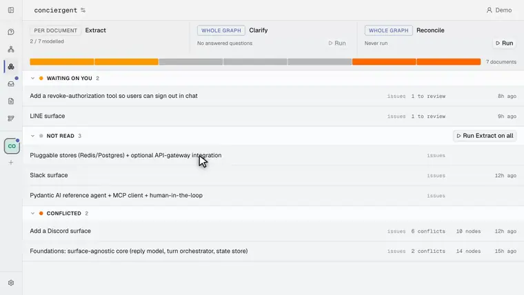
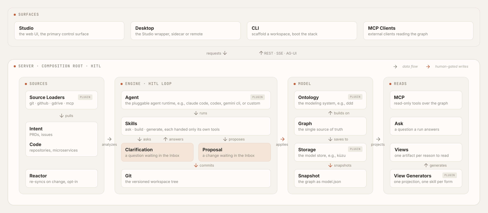
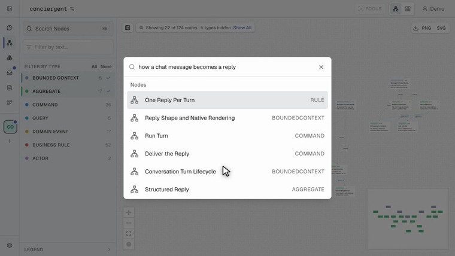
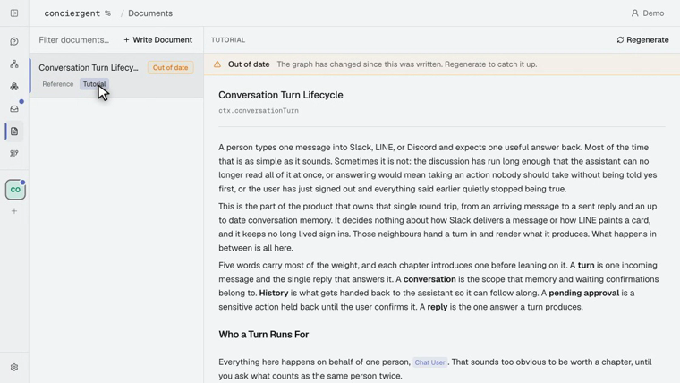

# Braid

[](https://github.com/mroops0111/braid/actions/workflows/ci.yml)
[](https://www.npmjs.com/package/@braidhq/cli)
[](https://www.npmjs.com/package/@braidhq/cli)
[](https://nodejs.org)
[](LICENSE)

_A framework for one reviewed model of your domain. Agents draft it from your sources, people decide what lands, and every node cites what it was drawn from._



_A finished model: [`examples/conciergent`](examples/conciergent/), 120 nodes Braid drew from one codebase with no intent docs._

**A shared model of your business, not another code graph.** Code is what shipped. Intent is what the team meant. They drift apart every sprint, and the team ends up arguing about which one is right.

Braid _braids_ them back into one domain model that engineers and PMs can both read. The default ontology is Domain-Driven Design (DDD), so people and the AI both speak the ubiquitous language of the domain instead of class names and package paths.

Braid harnesses a coding agent, Claude Code. Each run sees only the tools its kind of run may call, and a node that cites nothing is refused. The harness is what lets an AI be the author here.

## Features

- **Human-in-the-Loop Gate**: the AI drafts and asks, but a person decides before any change lands, and every decision it lands commits to Git.
- **Cross-Source Comparison**: intent and code are read against each other, each recorded with the lines it came from. Where the two disagree, Braid records it with both references and leaves which one is right to a person.
- **Rendered Output**: what a run produces arrives as the shapes that suit it, a table, a matrix, a finding, a piece of the graph. The model picks which shapes it needs. How they look belongs to the UI, so every run reads the same way.
- **Projected Views**: one model, and an artifact for each reason to read it, a reference or a tutorial, each saying when it falls behind. Not one PRD with one viewpoint, stale for everyone at once.
- **Continuous Reaction**: as sources change, Braid feeds the diff back as a fresh Proposal, so the canonical graph keeps up instead of becoming a snapshot of the day it was built.

## Motivation

Braid is built against three failure modes.

- **Code-Only Graphs**: tools that pull a graph straight from source are honest about what runs, but the result is a class-and-call-site graph. It cannot tell you why a feature exists, who asked for it, or what trade-off shaped its rules. PMs cannot read it.
- **Doc-Only Knowledge**: PRDs, design docs, Notion, and Confluence speak the domain, but nothing ties a sentence to the code behind it. Once the code moves nobody can say which parts still hold, so the whole set stops being trusted.
- **Folder-Only Structure**: nesting is the only relationship a set of documents has. One document is a workflow, the next a state machine, the next a rule that constrains half the product, and nothing can record that the third governs the other two.

## Design

Braid is a pluggable framework over a fixed runtime shape. The axes are swappable, the review loop and the human gate are not.

### Framework

Every axis is a plugin, and the defaults are a starting point rather than a built-in assumption.

- **Swappable Axes**: the ontology, source loaders, storage, agent, and view generators are all plugins, each overridable in one manifest field.
- **Framework Invariants**: the human-in-the-loop gate, the evidence requirement, and the branded type discipline are enforced by the type system and cannot be swapped out.
- **Braid Anything**: the same loop, gate, and provenance carry over whether you braid a codebase, a research corpus, or a product spec.

### The Ontology

Of the five axes this is the one a workspace feels, because it decides what the graph is made of and in whose words. Four things every ontology declares, answered below by the DDD one a workspace gets unless it names another.

- **Types and Named Edges**: what a node may be, and which relationships may hold between them. DDD ships eight types and fifteen edges, so a rule constraining an operation is recorded as that edge, and the graph can be asked which rules reach it.
- **Source Roles**: what a workspace must supply. DDD requires code and takes intent wherever there is any.
- **Audiences**: who an answer is written for, and how much of a reference each one sees. DDD splits business from engineering.
- **Build Skills**: the pipeline itself. Build reads the steps, their order, and their labels from here, so swapping the ontology changes the pipeline and nothing else.

### Architecture

The server is the composition root. Sources feed an event-driven engine that produces reviewable changes, a human gate lands them in one canonical model, and every write is versioned in Git.



- **Surfaces**: Studio (web UI), Desktop, and MCP clients all talk to one server, over REST with an SSE event stream and AG-UI beside it. The CLI scaffolds a workspace and boots the stack.
- **Sources**: Intent and Code are pulled into the workspace by Source Loader plugins, and the Reactor re-syncs them as they change, wherever a workspace opts in.
- **Engine**: the Agent is a plugin like the rest, and the Skills it runs each see only their own tools. Where a run reaches a point only a person can settle it emits a Handoff, either a Proposal or a Clarification, and both land in one queue, because what makes them one kind is who must act next. What a person lands commits to the versioned workspace tree.
- **Model**: the Ontology types the graph, the graph is the single source of truth, a Storage plugin such as Kuzu persists it, and a `model.json` snapshot travels with the code.
- **Reads**: read-only MCP tools over the graph, Ask for a question a run answers, and Views projected by a generator, one artifact per reason to read.

### AI-Native Design

The AI is the author and a person is the reviewer, which is the reverse of the usual arrangement. Everything below follows from that one inversion.

- **No Authoring Surface**: there is no form for creating a node. The graph grows only when a run proposes and a person applies, and every node carries the source it was drawn from. Both are invariants, not settings.
- **Composed at Run Time**: what a run does is not written in code. A skill supplies the instruction, and the tools it may call are handed to it as a set narrowed to that kind of run, so an `ask` run does not decline to propose, it cannot see the call. Change either and the behaviour changes, with nothing in the engine touched.
- **A Standard Wire**: a run streams over [AG-UI](https://github.com/ag-ui-protocol/ag-ui), a protocol Braid did not invent, so any client that speaks it can drive or display a run. Studio reads it with the protocol's own client, which is what makes that claim checkable.

### Reading the Graph

The graph is readable on its own, and readable through something that composes an answer out of it.

[](.github/assets/graph-and-ask.webp)

_The question says message and reply. `Run Turn` and `Conversation Turn Lifecycle` say neither, and they are what it was asking for. [Play the clip](.github/assets/graph-and-ask.webp) to see one opened, then the same question put to Ask._

[](.github/assets/reference-and-tutorial.webp)

_One subject, two forms, both already out of date because the graph moved under them. [Play the clip](.github/assets/reference-and-tutorial.webp) to read down each of them._

- **The Graph Surface**: the canvas and the table, search, and a node with its evidence and its neighbours. Point an embedding endpoint at a workspace and search ranks by meaning as well as by name, so a question finds a node that never uses its words.
- **MCP**: a read-only endpoint at `<api>/braid/mcp` carrying seven operations, from node search to the whole snapshot. It exchanges each caller's own token, so a person's client reads the graph as them.
- **Ask**: a question a run answers over the graph, composed as blocks.
- **Views**: a generator declares what it may be written about and the forms it writes, projects the subject into material, and one skill per form writes the page.

## Usage

Get a workspace running, then work the review loop in Studio.

### Quick Start

Two ways in. Both need the `claude` CLI signed in, since a skill run is a subprocess of it and nothing runs without one.

**From a checkout**, for working on Braid itself. Node 22 or later, and pnpm.

```bash
git clone https://github.com/mroops0111/braid
cd braid && pnpm install && pnpm dev
# Studio at http://localhost:5173, server at :4321
```

**From the container**, which is what a deployment runs. One image serves the API and the built Studio on one origin, so there is no Vite in the picture.

```bash
cp .env.example .env   # fill in the four required values
docker compose up
# Studio and the API at http://localhost:4321
```

Either way, open Studio and create a workspace with the Wizard, then add your intent and code sources.

`.env.example` names what a deployment sets and what each value turns on. `compose.oidc.yaml` adds Keycloak for a deployment that wants its own authorization server, which is also what turns the MCP endpoint on. [`@braidhq/server`](packages/server/README.md#deployment) documents every variable the server reads and what each does when absent.

### The Loop

Four steps, and a person ends every one of them.

- **Build**: run the ontology's pipeline over one source document or over a group. Build lists every document and what the model has made of it so far.
- **Review**: read what the run left in the Inbox, where a question it stopped on and a change it proposed sit as two kinds of card in one queue.
- **Apply**: land the change when its validation is green, or reject it with a reason. The queue moves to the next card either way.
- **Read**: put a question to Ask, or write a subject into a document on Documents and pick the form it takes.

## Packages

**Framework Core**

| Package | Description |
|---|---|
| [`@braidhq/schema`](packages/schema/) | Zod schemas and branded types. The wire-format contract for every package. |
| [`@braidhq/core`](packages/core/) | Domain entities, application services, and plugin port interfaces, with no concrete adapters. |
| [`@braidhq/sdk`](packages/sdk/) | Author SDK for ontology, source loader, and view generator plugins. |

**Plugins**

| Package | Description |
|---|---|
| [`@braidhq/ontology-ddd`](packages/ontology-ddd/) | Default DDD ontology: boundedContext, aggregate, command, query, event, rule, actor, and policy. |
| [`@braidhq/storage-kuzu`](packages/storage-kuzu/) | Embedded Kuzu graph store, a zero-infra single-binary alternative to Neo4j. |
| [`@braidhq/source-loader-git`](packages/source-loader-git/) | Clone a repository and sync it automatically. |
| [`@braidhq/source-loader-github`](packages/source-loader-github/) | Sync a GitHub repository over the API, OAuth on first use. |
| [`@braidhq/source-loader-gdrive`](packages/source-loader-gdrive/) | Export documents from Google Drive, OAuth on first use. |
| [`@braidhq/source-loader-mcp`](packages/source-loader-mcp/) | Mirror an API-backed source by paging one MCP tool, one file per item. |
| [`@braidhq/view-generator-doc`](packages/view-generator-doc/) | Project a container node into material, and write it as a `reference` or a `tutorial`. |
| [`@braidhq/agent-claude-code`](packages/agent-claude-code/) | Runs the `claude` CLI to execute SKILL.md prompts, the default LLM backend. |

**Surfaces**

| Package | Description |
|---|---|
| [`@braidhq/server`](packages/server/) | REST, SSE, and AG-UI server, the composition root. |
| [`@braidhq/cli`](packages/cli/) | Command-line entry point. |
| [`@braidhq/studio`](packages/studio/) | Web UI. |
| [`@braidhq/desktop`](packages/desktop/) | Tauri desktop shell. |

## Extending Braid

Two extension surfaces, neither touching the core. Both are files on disk, not forms in Studio.

**A plugin** adds a swappable axis. It implements a port, and you register it where you start the server, `startServer({ extraOntologyPlugins: [mine] })`, so swapping an axis means owning the entry point rather than configuring `braid serve`. See [`@braidhq/sdk`](packages/sdk/) for the five `define*Plugin` builders, and the shipped plugins for implementations to copy.

**A skill** adds an AI capability. It is a `SKILL.md` at `<workspace>/skills/<verb>/SKILL.md`, invoked as `/workspace:<verb>`, and its `category` decides where it belongs.

- **`build`**: its own stage on Build, running over a source document, and may propose. One run at a time. The one category a workspace can add by itself.
- **`ask`**: answers on Ask, offered the render calls but no way to write. Ask reaches for one such skill, today the built-in one, so a second is read and not yet offered.
- **`generate`**: writes a document, and the only category offered `showSection`, `showCheck`, and `showCustom`. A form and its writer are declared together by a view generator, so this one arrives with a plugin.

An `EXTEND.md` at `<workspace>/skill-extensions/<verb>/` adds rules to a built-in skill instead of replacing it.

```markdown
---
name: quick-extract
description: Extract DDD entities from intent + code
argumentHint: <ctx-name>
model: opus
braid:
  category: build
  requiredEnv: [GITHUB_TOKEN]
---
Walk `intent/` and `code/`. Emit proposals that add boundedContext, aggregate, and command nodes. Cite the source and the lines each node was drawn from.
```

The `braid:` block is preflighted before the agent spawns, so a missing env var or MCP server fails fast with a clear error.

## Status

Braid is at `0.6.0` and pre-1.0. It is used against real workspaces, and the shape of the graph, the review loop, and the human gate have held for months. The surfaces and the plugin contracts still move between minor versions, and a release that breaks one says so.

## License

[MIT](LICENSE)
