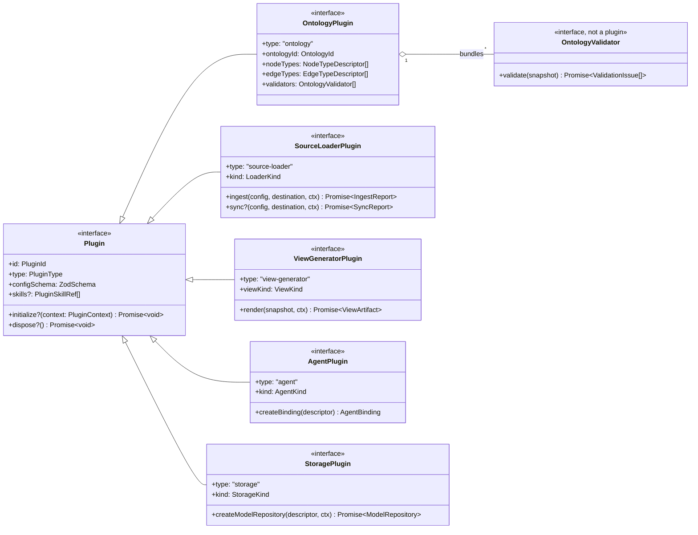
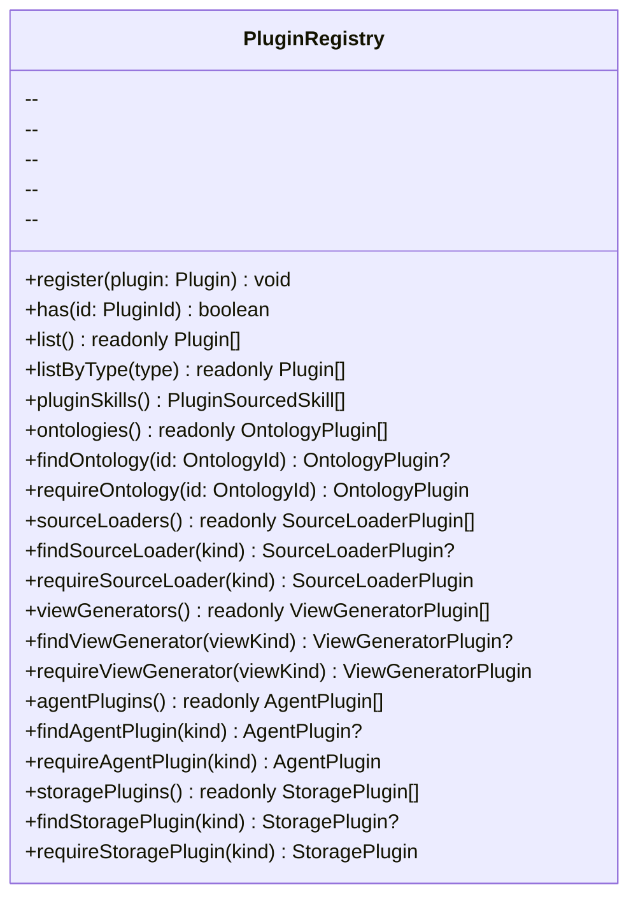
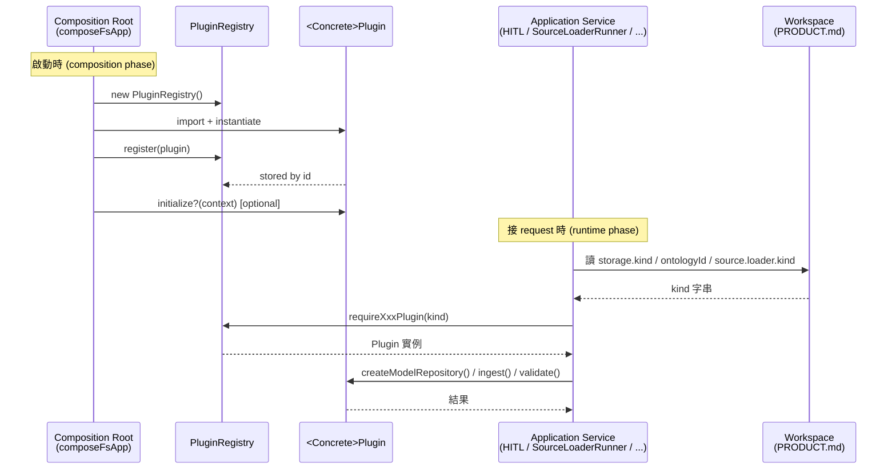
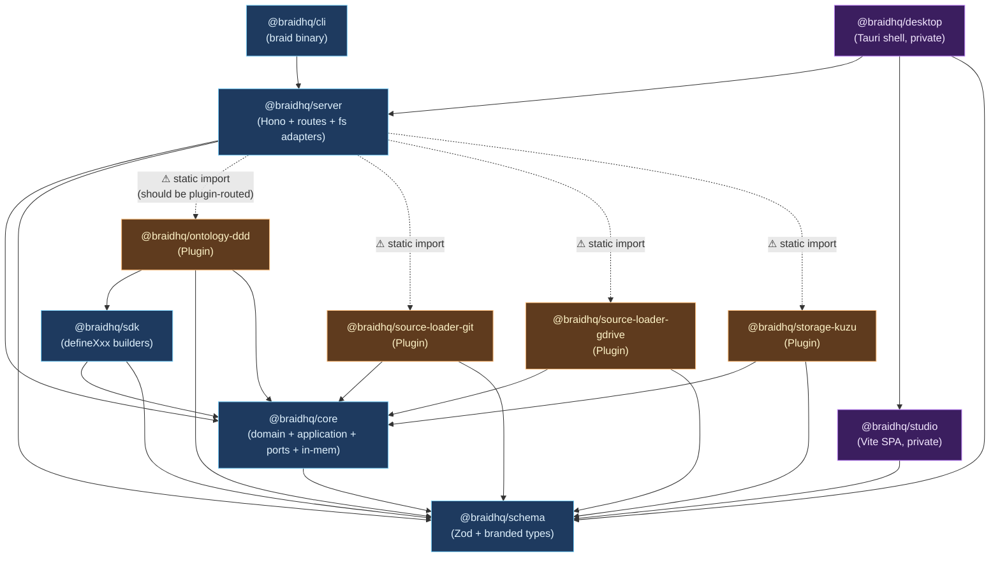
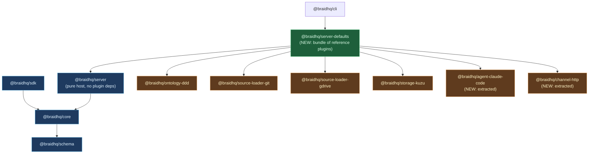

# Braid Package & Plugin Architecture

> Version: 2026-05-17
> Authoritative source for: package layout, plugin contracts, ownership boundaries.
> Supersedes the "Repo 結構" section of `OSS-PROPOSAL.md` and §10–11 of `ARCHITECTURE.md`.

---

## 0. 這份文件給誰看

| 讀者 | 你會關心 |
|---|---|
| **Owner** (mroops0111) | 我預設要維護什麼？package 數會怎麼長？ |
| **Maintainer / Contributor** | 加新 plugin / 改 host code 該動哪一個 package？ |
| **Plugin author (第三方)** | 我要寫的東西放哪、用哪個介面、發到哪個 npm scope？ |
| **End user** | 我安裝什麼？哪些是 optional？ |

如果你只想看 domain model 跟流程，去 `ARCHITECTURE.md`。**這份文件只回答「package 跟 plugin 的切法、邊界、合約」**。

---

## 1. 兩個基礎概念

### 1.1 Package

> **Package** = 一個 npm 發布單位（一個 `package.json`，一個 version、release lifecycle、install footprint）。

Braid monorepo 把所有 first-party package 放在 `packages/` 跟 `plugins/` 兩個目錄，**目錄分類純粹是視覺習慣，跟 architectural 意義無關**。

### 1.2 Plugin

> **Plugin** = 一個具體實作了「Braid plugin port (介面)」的物件。

Braid 定義了 **7 條 plugin axes**（見 §4）：Ontology / SourceLoader / Validator / Generator / AgentPlugin / StoragePlugin / ChannelPlugin。每條 axis 的具體實作（DDD ontology / Git loader / Kuzu storage / ...）都是一個 Plugin。

### 1.3 Package ⊇ Plugin

| 關係 | 範例 |
|---|---|
| 一個 Package 包含一個 Plugin | `@braidhq/storage-kuzu` ships `kuzuStoragePlugin` |
| 一個 Package 不含 Plugin（純 host 或純 lib） | `@braidhq/schema`、`@braidhq/core`、`@braidhq/server` |
| 一個 Plugin 不獨立成 Package（workspace-local） | 使用者在自己 workspace 的 `plugins/<x>.ts` 裡寫的 |

**規則：一個 Package 不該包多個獨立 Plugin。**「同 axis 的多個實作」是 §3 Model A 的核心問題。

---

## 2. 為什麼需要 Plugin 機制

Braid 的 thesis（從 Intent + Code 萃取 Model，HITL 投影 View）有**強制的「可換」需求**：

- 不同團隊用不同 domain ontology（DDD / C4 / Event Modeling / 自訂）
- 不同部署規模選不同 storage backend（Kuzu 給單機，Neo4j 給團隊，Memgraph 給企業）
- 不同 source 接入（git / Drive / Notion / S3 / 自訂）
- 不同 LLM agent（Claude Code subprocess / Anthropic API / Cursor / Ollama）

**這些都不能在 core 寫死**。Plugin 機制是把這些「可換點」變成 first-class 的契約 + registry。

---

## 3. Model A：Per-Implementation Package

### 3.1 The rule

> **每一個具體的 Plugin 實作 = 一個獨立 npm package**。不看依賴大小、不看依賴類型、不看是不是 first-party。

對應業界：TipTap / Backstage / Hono / Vite 第三方 plugin / Astro integration 全部走這條。

### 3.2 例外

只有兩種情況**不**獨立 package：

| 情境 | 走哪 |
|---|---|
| Workspace 一次性 plugin（使用者自己寫的，只給自己用） | `<workspace>/plugins/<x>.ts`，由 `PluginLoader` runtime 動態載入（Theme 7） |
| Test fakes（in-memory adapter 等） | 留在 host package 內當 `infrastructure/in-memory/`，**不對外發布** |

### 3.3 為什麼不 group-by-axis

考慮過的替代方案：

| 方案 | 為什麼不採用 |
|---|---|
| `@braidhq/ontologies` 內含 ddd / c4 / ... | 第三方寫 `@somecorp/braid-ontology-x` 時模式不對稱；改一個全部升版；不縮減 release 工作量太多 |
| `@braidhq/storages` 內含 kuzu / neo4j | 同上 + 強迫不要 kuzu 的人下載 150MB native binding |
| 全部塞進 `@braidhq/core` | 違反 plugin 機制本意（contract 跟 impl 分離） |

「太多 package」的真正成本是 release 工作量，**用 changesets + Turbo 自動化解決**。Backstage 400+ packages 不靠合併撐起來。

---

## 4. Plugin Axes (5 個 ports)

| Axis | Port interface | Registry accessor | Workspace 決定 active 的方式 |
|---|---|---|---|
| **Ontology** | `OntologyPlugin` (`@braidhq/core`) | `pluginRegistry.requireOntology(id)` | `productManifest.ontologyId` |
| **SourceLoader** | `SourceLoaderPlugin` | `requireSourceLoader(kind)` | `source.loader.kind` per source |
| **ViewGenerator** | `ViewGeneratorPlugin` | `requireViewGenerator(viewKind)` | View 生成請求的 `viewKind` |
| **Agent** | `AgentPlugin` | `requireAgentPlugin(kind)` | `agentBindings[].kind` (透過 `agents.tasks` routing 選某個 binding 的 kind) |
| **Storage** | `StoragePlugin` | `requireStoragePlugin(kind)` | `productManifest.storage.kind`（per-server-process: 從 env / option 決定） |

不再是 axis 的概念：

- **Validator**: framework 不變量寫在 `ValidationService` inline；ontology-derived 規則由 `defineOntology()` 自動綁進 `OntologyPlugin.validators[]`。沒有 user-pluggable Validator axis（暫時不需要）。
- **Channel**: CLI / Studio / Desktop / MCP server / VS Code ext 等是**獨立的 client 應用**（自己的 npm package），不是 server-internal 的 plugin axis。Server 對外只有 REST + SSE 一條 transport，固定。

詳細介面 UML 在 §7。

---

## 5. Package Taxonomy (3 個 Tier)

### Tier 1 — Host (你**永遠**要維護)

純 framework，沒有 plugin。Owner-owned，所有 Braid 部署都需要。

| Package | 角色 | 業界對應 |
|---|---|---|
| `@braidhq/schema` | Zod schema + branded types + DTO 介面 | `@backstage/types`、`@vite/types` |
| `@braidhq/core` | Domain entities + application services + plugin ports + in-memory adapters | `@backstage/backend-defaults`、`vite/core` |
| `@braidhq/sdk` | Plugin author 的 `defineXxx()` builder | `@backstage/plugin-api`、`@tiptap/core` (subset) |
| `@braidhq/server` | Hono REST + fs adapters + composition root | `@backstage/backend` |
| `@braidhq/cli` | `braid` 命令列 | `@vite/cli` |

### Tier 2 — Client (你**永遠**要維護，但是 distribution shape)

跟 Server 透過 REST/SSE 對話的 client。每個是「具體部署形態」，不是 plugin。

| Package | 角色 | private | 業界對應 |
|---|---|---|---|
| `@braidhq/studio` | Vite + React SPA | ✅ | `@backstage/app` |
| `@braidhq/desktop` | Tauri 殼 (Phase 6) | ✅ | (Tauri-shell pattern) |

未來可能新增的 client（仍然 Tier 2，獨立 package）：

- `@braidhq/mcp-server` — 把 Braid 當 MCP server 暴露
- `@braidhq/vscode-ext` — VS Code extension
- `@braidhq/github-action` — CI 用 GitHub Action

### Tier 3 — Plugins (依你的選擇維護)

**這層是 §6「Ownership Tiers」的舞台**。每個是一個 Plugin axis 上的一個具體實作。

當前狀態：

| Package | Axis | 你維護? |
|---|---|---|
| `@braidhq/ontology-ddd` | Ontology | ✅ first-party reference |
| `@braidhq/storage-kuzu` | Storage | ✅ first-party reference |
| `@braidhq/source-loader-git` | SourceLoader | ✅ first-party reference |
| `@braidhq/source-loader-gdrive` | SourceLoader | ✅ first-party reference |

未來會出現的：

| Package | Axis | 維護歸誰? |
|---|---|---|
| `@braidhq/storage-neo4j` | Storage | 你 (Phase 4 規劃) |
| `@braidhq/ontology-c4` / `-event-modeling` | Ontology | 你 ship 第一個 reference，社群可投稿 |
| `@braidhq/source-loader-s3` / `-notion` | SourceLoader | 視需求決定 first-party 或 community |
| `@braidhq/agent-claude-code` (從 server 抽出) | Agent | 你 |
| `@braidhq/agent-anthropic-api` / `-cursor` / `-ollama` | Agent | 你 ship 1-2 個 reference，剩下社群 |
| `@braidhq/channel-http` (從 server 抽出) | Channel | 你 |
| `@braidhq/channel-mcp` / `-slack` | Channel | 視需求 |
| `@braidhq/generator-mermaid` / `-openapi` | Generator | 視需求 |
| `@braidhq/validator-naming` / `-compliance` | Validator | 視需求 |

---

## 6. Ownership Tiers (誰維護什麼)

```
┌─────────────────────────────────────────────────────────────┐
│ Tier A  First-Party (你維護)                                │
│ 範圍: 所有 host packages + 每條 axis 至少 1 個 reference   │
│ npm scope: @braidhq/*                                       │
│ 授權: Apache 2.0 / MIT (跟主 repo 一致)                    │
│ Release: 跟 monorepo 一起 release (single semver)           │
└─────────────────────────────────────────────────────────────┘
┌─────────────────────────────────────────────────────────────┐
│ Tier B  Community (社群維護)                                │
│ 範圍: 任何沒進 Tier A 的 plugin axis 實作                  │
│ npm scope: 各自的 npm scope (@somecorp/braid-*)             │
│ 授權: 各自決定                                              │
│ Release: 各自                                              │
│ Listing: braid/awesome-braid repo 索引                      │
└─────────────────────────────────────────────────────────────┘
┌─────────────────────────────────────────────────────────────┐
│ Tier C  Workspace-Local (使用者個人)                        │
│ 範圍: 一次性、不發布的 plugin                              │
│ 位置: <workspace>/plugins/<x>.ts                            │
│ Loader: 未來 PluginLoader runtime (Theme 7)                 │
└─────────────────────────────────────────────────────────────┘
┌─────────────────────────────────────────────────────────────┐
│ Tier D  Commercial / Private (受限維護)                     │
│ 範圍: 含 NDA / commercial license / 私有 ontology           │
│ npm scope: @braid-commercial/* 或私有 registry              │
│ Release: 各自                                              │
└─────────────────────────────────────────────────────────────┘
```

### 6.1 你 (Owner) 的維護承諾

對外文件講清楚：你**只保證 Tier A 的品質**。Tier A 內容：

1. **每個 host package**（schema / core / sdk / server / cli + 兩個 client）
2. **每條 plugin axis 至少 1 個 reference implementation**：
   - Ontology: `ontology-ddd`
   - Storage: `storage-kuzu`（embedded 入門款）
   - SourceLoader: `source-loader-git`（最常見的 code source）
   - Agent: `agent-claude-code`（thesis 的預設 agent）
3. **使用者真實需求高的 plugin**：當社群還沒交出來、但缺了會卡使用者 v1 體驗的，**你補一個**：
   - `source-loader-gdrive`（Intent 常見來源）
   - `storage-neo4j`（Tier 2/3 部署常見需求）
   - `channel-http`（HTTP REST，現在綁在 server 裡，未來抽出）

對於「我想預設支援」的東西：**等於把它加進 Tier A 名單**。心智模型：

> **想預設支援 = 願意當第一個 maintainer + 出 release**。一旦你列為 Tier A，使用者就會以為「ship 這個版本之後永遠 work」。所以加東西進 Tier A 之前先想清楚願不願意每個 minor release 都 verify 它還能跑。

### 6.2 該降到 Tier B 的訊號

| 訊號 | 動作 |
|---|---|
| 一個 Tier A plugin 3 個月沒 issue 沒 PR 沒 user 抱怨 | 考慮降到 Tier B（找 community maintainer 接手） |
| 某個 axis 累積到 ≥3 個社群實作 | 你的 reference 可以保留，其他丟到 awesome-braid |
| Commercial 客戶要求你不要動 ontology-xxx | 拒絕，請對方 fork 成 commercial plugin |

---

## 7. Plugin Interface UML

### 7.1 Class diagram



### 7.2 PluginRegistry surface



**所有 plugin 從同一個 `PluginRegistry.register(plugin)` 入口進入；查詢透過 typed accessor 出來**。Host code 不該 `import` 具體 plugin class，永遠透過 registry。

### 7.3 Plugin lifecycle (composition + runtime)



---

## 8. Dependency Graph

### 8.1 現況 (post A1)



### 8.2 Rules the graph enforces

| 規則 | 為什麼 |
|---|---|
| 箭頭只能朝下（`host → schema`、`plugin → core/schema/sdk`） | Hexagonal: domain 不知道 infrastructure |
| `core` 不依賴任何 plugin package | Core 是 contract owner，不該認識具體 impl |
| `server` 目前依賴所有 default plugins (虛線) | **這是 §9 audit 第 1 條**：v0.1 容忍，v0.2 計畫拆 |
| `studio` 不依賴 `server` 任何 runtime code | SPA 透過 REST/SSE 對話，不該編譯時耦合 |
| `cli` 透過 `server` 起 process | CLI 是 server 的 launcher，不是它的客戶端 |

### 8.3 目標狀態 (v0.2+)



Backstage 同樣 pattern：`@backstage/backend` 純 host，`@backstage/backend-defaults` 預打包預設 plugin。

---

## 9. Audit: 現況沒解耦乾淨的地方 (2026-05-17 整理 / 多數已修)

按嚴重度排：

### ✅ Resolved

| # | 原問題 | 修法 |
|---|---|---|
| 9.1 | `Workspace.pluginConfig.plugins` 解析了沒用 | 從 `ProductManifest` schema 移除；`Workspace.ts` 移除 getter |
| 9.2 | `Workspace.channels` 解析了沒用 | 連同 `ChannelDescriptor` schema、`ChannelPlugin` interface、`PluginRegistry.channelPlugins/findChannelPlugin/requireChannelPlugin` 一起移除。Channel axis 整條砍掉（client 應用 ≠ server-internal plugin） |
| 9.3 | composeFs 靜態 import `dddOntology` | `composeFsApp.extraOntologyPlugins?` option；defaults 先註冊 ddd，extras 接著註冊；workspace 透過 `productManifest.ontologyId` 選 active |
| 9.4 | composeFs 靜態 import `GitLoader`/`GoogleDriveLoader` | `composeFsApp.extraSourceLoaderPlugins?` option；defaults 先註冊，loader 由 source descriptor `loader.kind` 路由 |
| 9.6 | `OntologyTypeValidator`/`StructuralValidator` 用 literal `dddOntology` 建構 | Validator axis 整條砍掉。4 個 validator 重新歸位：framework invariant（Evidence/OrphanEdge）由 `ValidationService` inline 呼叫；ontology-coupled（OntologyType/Structural）由 `defineOntology()` 自動綁進 `OntologyPlugin.validators[]`，`ValidationService.validate(snapshot, workspace)` 跑當前 ontology 的 validators |
| 9.7 | Workspace `ontologyId` 在 read 路徑被尊重、寫路徑寫死 ddd | 解決同 9.6 — 同一 instance lookup |
| 9.8 | Workspace `agentBindings[].kind` 是 dead schema | `composeFsApp.extraAgentPlugins?` option + `agentKind` option；`ClaudeCodeAgentBinding` 包成 `claudeCodeAgentPlugin` 由 registry 路由 |

### 🟡 Open (intentional)

| # | 問題 | 為什麼留著 |
|---|---|---|
| 9.5 | `@braidhq/server/package.json` 仍直接 dep `@braidhq/ontology-ddd` / `-storage-kuzu` / `-source-loader-*` | **架構意圖已乾淨**（兩個 entry：`composeApp` 純 host / `composeFsApp` 開箱即用 bundle），install footprint 沒改。真要拆 install footprint 需要 subpath exports + 動態 import + optional peerDeps，工程複雜度高於收益。等到有實際純 host 部署需求再做。**現況純 host 部署可行 — 用 `composeApp(myDeps)` 不碰 `composeFsApp`** |
| 9.9 | Workspace `storage.kind` 解析了但 server-process 永遠用 env / option 決定 | 設計取捨：多 workspace 共一個 server-process 預期都用同 storage backend。要 per-workspace 切換需要 modelRepository 工廠 + 路由層，遠超 architectural 收益。文件記下這條約定 |

### 🟢 Acceptable (not a violation)

| # | 問題 | 為什麼可接受 |
|---|---|---|
| 9.10 | 2 個 framework invariant validators（Evidence、OrphanEdge）在 `@braidhq/core/infrastructure/validation/` | 它們是 framework 不變量、不是 user-replaceable plugin。`ValidationService` inline 呼叫，**沒進 PluginRegistry** |
| 9.10b | 2 個 ontology-coupled validators（OntologyType、Structural）也在 `@braidhq/core` | 它們是 generic 引擎，吃 ontology 資料運作。每個 ontology 透過 `defineOntology()` 自動構造一份綁定自己的實例放進 `OntologyPlugin.validators[]`。Code 在 core 共享、binding 在 ontology package |
| 9.11 | In-memory adapters 在 `@braidhq/core` | Test fakes，不對外發布 |
| 9.12 | `productManifestWriter.ts` default storage `'kuzu'` / default agent `'claude-code'` | CLI scaffold 需要 opinionated defaults |
| 9.13 | `init.ts` template 寫死 `kind: kuzu` / `kind: claude-code` | 同上 |

### Composition 的兩條路徑（修完之後）

```ts
// 純 host 部署 — 自己準備 plugins
import { composeApp, createApp, PluginRegistry } from '@braidhq/server'
import { myOntology, myStoragePlugin, myAgentPlugin } from '@somecorp/braid-...'

const registry = new PluginRegistry()
registry.register(myOntology)
registry.register(myStoragePlugin)
registry.register(myAgentPlugin)
const deps = composeApp({ pluginRegistry: registry, /* repos, modelRepo, agentBinding ... */ })
const app = createApp(deps)
```

```ts
// 開箱即用 — defaults bundle + 自加 extras
import { composeFsApp, createApp } from '@braidhq/server'
import { c4Ontology } from '@somecorp/braid-ontology-c4'
import { neo4jStoragePlugin } from '@somecorp/braid-storage-neo4j'

const deps = await composeFsApp({
  extraOntologyPlugins: [c4Ontology],
  extraStoragePlugins: [neo4jStoragePlugin],
  storageKind: 'neo4j' as never,
})
const app = createApp(deps)
```

---

## 10. Plugin Author Recipe

### 10.1 寫一個新 Ontology

```ts
// @somecorp/braid-ontology-c4/src/index.ts
import { defineOntology } from '@braidhq/sdk'
import type { EdgeTypeId, NodeTypeId } from '@braidhq/schema'

export const c4Ontology = defineOntology({
  ontologyId: 'c4',
  nodeTypes: [
    { id: 'system' as NodeTypeId, label: 'System', description: '...' },
    { id: 'container' as NodeTypeId, label: 'Container', description: '...' },
    // ...
  ],
  edgeTypes: [
    {
      id: 'contains' as EdgeTypeId,
      fromTypes: ['system' as NodeTypeId],
      toTypes: ['container' as NodeTypeId],
      cardinality: '1:N',
    },
    // ...
  ],
})
```

Workspace 啟用：

```yaml
# PRODUCT.md frontmatter
ontologyId: c4
```

Server 啟動時註冊：

```ts
import { c4Ontology } from '@somecorp/braid-ontology-c4'

await composeFsApp({
  extraOntologies: [c4Ontology],  // 待實作 §9.3 fix
})
```

### 10.2 寫一個新 SourceLoader

```ts
// @somecorp/braid-source-loader-s3/src/index.ts
import { defineSourceLoader } from '@braidhq/sdk'
import { z } from 'zod'
import { S3Client, GetObjectCommand, ListObjectsV2Command } from '@aws-sdk/client-s3'

export const s3Loader = defineSourceLoader({
  kind: 's3',
  configSchema: z.object({
    bucket: z.string(),
    prefix: z.string().default(''),
    region: z.string(),
  }),
  ingest: async (config, destination) => {
    // ... use AWS SDK to walk bucket + write files
    return { localPath: destination, fetchedAt: new Date().toISOString() as never }
  },
  sync: async (config, destination) => {
    // ... incremental
    return { changed: true, fetchedAt: new Date().toISOString() as never }
  },
})
```

### 10.3 寫一個新 StoragePlugin

```ts
// @braidhq/storage-neo4j/src/index.ts
import type { StoragePlugin, StoragePluginContext } from '@braidhq/core'
import type { PluginId, StorageDescriptor, StorageKind } from '@braidhq/schema'
import { z } from 'zod'
import { Neo4jModelRepository } from './Neo4jModelRepository.js'

export const neo4jStoragePlugin: StoragePlugin = {
  id: 'storage.neo4j' as PluginId,
  type: 'storage',
  kind: 'neo4j' as StorageKind,
  configSchema: z.object({
    uri: z.string(),
    user: z.string(),
    password: z.string().optional(),
  }),
  createModelRepository: async (descriptor, _ctx) =>
    new Neo4jModelRepository(descriptor.config as Neo4jConfig),
}
```

Server 啟動：

```ts
await composeFsApp({
  extraStoragePlugins: [neo4jStoragePlugin],
  storageKind: 'neo4j' as StorageKind,
})
```

或環境變數：

```bash
BRAID_STORAGE_KIND=neo4j braid serve
```
（搭配在 composition 點註冊插件）

### 10.4 Naming convention

| 內容 | npm 名稱 | npm scope |
|---|---|---|
| First-party reference | `@braidhq/<axis>-<impl>` | `@braidhq` |
| Community | `@<yourorg>/braid-<axis>-<impl>` 或 `braid-plugin-<axis>-<impl>` | 各自 |
| Commercial | `@braid-commercial/<axis>-<impl>` | `@braid-commercial` (私有) |

---

## 11. FAQ

**Q: 為什麼 `@braidhq/source-loader-git` 跟 `@braidhq/source-loader-gdrive` 不合併？**
A: 兩個 git-only 或 gdrive-only 的使用者不該被迫裝對方依賴。更重要的：第三方寫 `@somecorp/braid-source-loader-jira` 時跟 first-party 對稱，這條 axis 規則一致才好溝通。

**Q: 為什麼 validators 不每個獨立 package？**
A: 現在 `@braidhq/core` 內的 4 個 validators 是 framework invariant（不是 user-replaceable 的選項）。**真正的 user-pluggable validator** (e.g. `compliance-checker`) 進來時會獨立成 package。

**Q: `@braidhq/studio` 為什麼 private 不發布？**
A: 它是 SPA dist，不是 npm library。Handover task 2 規劃把它打包進 `@braidhq/server/studio-dist/`。

**Q: 我寫一個 first-party plugin，要不要納入 Braid monorepo？**
A: First-party = 是。在 `plugins/<name>/` 開新目錄，跟既有 `ontology-ddd` 同 layout。

**Q: 太多 package 怎麼辦？**
A: 用自動化（changesets + Turbo + release.yml）解決 release 工作量。Backstage 400+ 個沒崩，靠的是自動化不是合併。

**Q: Plugin 之間可以互相依賴嗎？**
A: 技術上可以（npm dep），但不建議。Plugin 該透過 `PluginRegistry` 解耦，例如 `StructuralValidator` 構建時拿 Ontology instance 而不是 `import { dddOntology }`。

---

## 12. Glossary

- **Axis** — 一條 plugin 介面（e.g. Ontology axis）
- **Plugin** — Axis 的一個具體實作
- **Host** — Framework 本身（core / schema / sdk / server / cli）
- **Client** — 透過 REST/SSE 跟 server 對話的應用（studio / desktop / future MCP）
- **Composition root** — Wiring 所有 plugin 跟 service 的單一函數（`composeFsApp`）
- **Reference implementation** — First-party、Tier A 維護的 plugin
- **Tier A/B/C/D** — Ownership 等級，見 §6
- **Model A** — Per-implementation package 切法，見 §3
