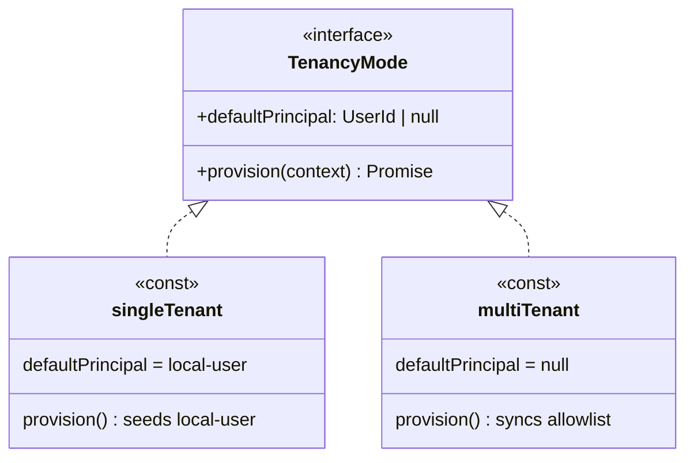

# @braidhq/server

Braid keeps a product's intent and its code aligned in one knowledge graph. `@braidhq/server` is the process that runs it. It wires core's ports to real filesystem, git, and vendor adapters, exposes the graph over HTTP, and drives the agents that fill it.

## Role

Server is the composition root and the presentation layer. It turns the framework into a running application.

- **The Wiring**: The composition root that binds core's ports to concrete adapters, the one place infrastructure is instantiated.
- **The Adapters**: Filesystem and git implementations of core's repositories and history, plus the subprocess runner that executes skills.
- **The API**: A REST and SSE surface built on Hono, one router per resource, with authentication, workspace scoping, and an OpenAPI 3 spec at `GET /openapi.json`.

## Structure

The package layers outward from core. Infrastructure implements core's ports, routes expose them, and composition binds the two.

```
src/
├── server.ts          process entry, serves the app
├── app.ts             builds the Hono app, mounts middleware and routes
├── composeApp.ts      the generic root, in-memory defaults
├── composeFsApp.ts    the production wiring
├── startup.ts         blocking per-workspace boot steps
├── tenancy.ts         TenancyMode strategy, singleTenant and multiTenant
├── routes/            one router per resource
├── middleware/        auth, cors, error mapping, workspace scoping
├── policy/            authorization rules
└── infrastructure/
    ├── fs/            filesystem repositories and serializers
    ├── git/           GitWorkspaceHistory
    ├── agent/         SubprocessSkillRunner and its event stream
    └── auth/, oauth/, secrets/, users/
```

- **composeApp / composeFsApp**: Two roots. `composeApp` takes a deps object and defaults every port to an in-memory adapter. `composeFsApp` builds the filesystem, git, and vendor adapters, then hands them to `composeApp`. Production runs the latter.
- **startup**: The two boot passes, `startupBeforeServe` and `startupAfterServe`. See Startup below for the full order.
- **infrastructure**: The real adapters behind core's ports. `fs/` persists the graph, proposals, and runs as files. `git/` records every workspace change as a commit. `agent/` runs a skill as a subprocess and streams its events back.
- **routes**: One `createXxxRouter(deps)` per resource, each taking only the services it needs. Bodies validate through zod, path ids parse through their branded schema.
- **middleware**: The cross-cutting edge. Auth resolves the user, workspace middleware scopes and authorizes the request, and the error middleware maps `BraidError` subclasses to problem+json status codes.

## Startup

The blocking phase runs inside `composeFsApp` before the server accepts a request, in two groups.

Provision host identity, who may use this server:

1. `tenancy.provision` seeds what the deployment's mode needs. Single-tenant seeds the `local-user` fallback account, multi-tenant syncs the login allowlist to the user roster. See Tenancy below.

Reconcile workspaces, register then boot each:

2. `discoverCanonicalWorkspaces` registers workspaces present on disk but absent from the registry.
3. `ensureWorkspaceOwners` gives any ownerless workspace the tenancy's default principal, or throws under multi-tenant where every workspace must have an explicit owner.
4. `startupBeforeServe` runs the per-workspace pass. Per workspace it provisions the git repo and store, recovers a batch left running by a killed process, subscribes the reactor when the workspace opts in, and fires a catch-up sync for each loader-backed source.

After `serve()`, the background phase runs cosmetic recovery that need not finish first, via `startupAfterServe`:

5. `reapOrphanRuns` marks runs left without a completion, from a killed process, as aborted so the UI does not show them active forever.

Both passes live in `startup.ts`, `startupBeforeServe` before `serve()` and `startupAfterServe` after. A new blocking per-workspace step is added to `startupBeforeServe`, a new background step to `startupAfterServe`. Provisioning tied to one adapter stays next to that adapter's construction. Source loaders take part without a bespoke step, the sync in step 4 fires for any registered loader.

## Tenancy

One axis separates a single-tenant local install from a multi-tenant remote server, who the implicit user is. Rather than scatter that decision, a `TenancyMode` strategy carries it, and the auth and ownership code reads the strategy, never a hardcoded `local-user`.



Three consumers read the strategy, none a hardcoded account. `authMiddleware` skips the Bearer gate when a principal is present. `userIdMiddleware` resolves an unauthenticated caller to the principal. `ensureWorkspaceOwners` gives an ownerless workspace the principal, or throws when there is none.

`composeFsApp` picks the mode from `BRAID_LOCAL_TRUST`, single-tenant by default. Adding a mode, a service account or an SSO-only deployment, is a new `TenancyMode`, with no change to the middleware, the ownership code, or boot.

## Boundaries

These are the rules for anyone editing server. They are enforced in review rather than by tooling.

- **Composition Only Here**: Infrastructure concretes are instantiated at the composition root, never inside a route or a service.
- **Routes Stay Thin**: A route validates input, calls one service, and shapes the response. Business rules live in core, not in the handler.
- **Adapters Implement Ports**: Every fs, git, or agent class satisfies an interface declared in core, so swapping one never touches the framework.
- **Errors Map at the Edge**: Domain code throws a `BraidError`, and the error middleware is the only place that turns it into an HTTP status.
- **Scope Through Middleware**: Workspace access is checked once in middleware, not re-derived inside each route.

## Dependencies

Server sits at the outer edge, above core and the plugin packages it bundles as defaults.

- **Depends On**: `@braidhq/core` and `@braidhq/schema`, `hono` for HTTP, `simple-git` for history, and the default plugin bundle of `storage-kuzu`, `agent-claude-code`, `ontology-ddd`, and `source-loader-*`.
- **Consumed By**: `cli` and the `desktop` Tauri shell, which run it as their backend.

## MCP Gateway

Skills run as claude subprocesses and reach this server's REST API as MCP tools, not by curl. An off-the-shelf translator, `openapi-mcp-gateway`, reads `/openapi.json` and re-exposes each operation as a tool named `braid-core`.

The gateway runs as a per-skill stdio child of claude, launched on demand through `uvx`. Its lifecycle tracks the skill run, so there is no long-lived gateway process, no open port, and no network auth to manage. The `streamable-http` transport would drop the `uv` dependency, but only by moving the gateway into a persistent HTTP service that needs its own port, lifecycle, and auth. For a local, per-run tool surface the stdio child is the smaller cost. The `streamable-http` transport stays first-class in the schema for third-party remote MCP servers, and for a future hosted Braid.

The one prerequisite is the `uv` runtime, which provides `uvx`:

```bash
brew install uv   # or see https://docs.astral.sh/uv/
```

The server preflight-checks for `uv` at boot. Without it, skills that declare `requiredMcpServers: ['braid-core']` show as not-ready in Studio, while every other skill keeps working. Pin a specific binary with `BRAID_UVX_BIN` for reproducible environments.

SSE streams, the OAuth HTML callback, and the workspace-admin routes are deliberately absent from the spec, they are not one-shot MCP tools. The `GET /openapi.json` test in `test/app.test.ts` pins that boundary.
