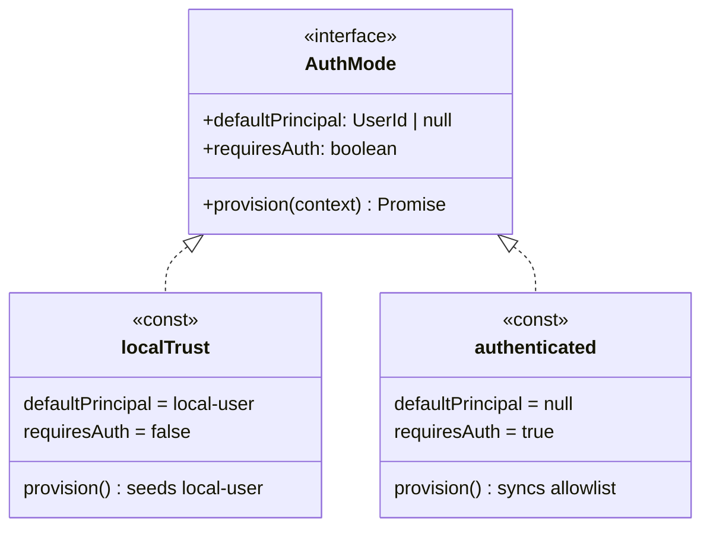

# @braidhq/server

Braid keeps a product's intent and its code aligned in one knowledge graph. `@braidhq/server` is the process that runs it. It wires core's ports to real filesystem, git, and vendor adapters, exposes the graph over HTTP, and drives the agents that fill it.

## Role

Server is the composition root and the presentation layer. It turns the framework into a running application.

- **The Wiring**: The composition root that binds core's ports to concrete adapters, the one place infrastructure is instantiated.
- **The Adapters**: Filesystem and git implementations of core's repositories and history, plus the subprocess runner that executes skills.
- **The API**: A REST and SSE surface built on Hono, one router per resource, with authentication, workspace scoping, and an OpenAPI 3 spec at `GET /openapi.json`.

## Positioning: framework kernel and worldview preset

Braid is worldview-agnostic. The intent-graph engine, workspaces, proposals, HITL review, the reactor, and the authorization policy, knows nothing about software. A worldview supplies the rest: an ontology plus the storage, source loaders, and agent that serve it. The software worldview, a DDD ontology whose sources split into `intent` and `code`, is the default, not a built-in.

Two layers share this package for now.

- **Kernel**: `composeApp`, routes, middleware, policy, auth mode, and the generic filesystem infrastructure. Worldview-agnostic. `composeApp` registers no plugin, a caller hands it a `PluginRegistry`. Nothing here imports a concrete ontology, storage, loader, or agent.
- **Coding preset**: `composeFsApp` assembles the default bundle, Kuzu storage, the DDD ontology, the git, github, and drive loaders, and the claude-code agent, over filesystem persistence. Its default identities live as `DEFAULT_*` constants at the head of the file.

A future app, a story world or a research-notes base, reuses the kernel and swaps the preset for its own ontology and adapters. When that second worldview arrives, the coding preset extracts into its own package, `@braidhq/preset-code`, and this package drops its plugin dependencies. Until a second worldview exists that pressure is speculative, so both layers stay here at no cost. The seam is `composeApp`: whatever the kernel reaches without a concrete plugin already belongs to it.

Such an app does not have to reimplement the runtime to get there. `composeFsAppWithRegistry(buildRegistry, options)` runs the same filesystem assembly as `composeFsApp`, the subprocess skill runner, the fs unit lister, and every fs repository, over a registry the caller builds. `composeFsApp` is that call with the preset's bundle.

## Structure

The package layers outward from core. Infrastructure implements core's ports, routes expose them, and composition binds the two.

```
src/
├── server.ts          process entry, serves the app
├── app.ts             builds the Hono app, mounts middleware and routes
├── composeApp.ts      the worldview-agnostic kernel root
├── composeFsApp.ts    the coding preset, filesystem and vendor adapters
├── startup.ts         blocking per-workspace boot steps
├── authMode.ts        AuthMode strategy, localTrust and authenticated
├── routes/            one router per resource
├── middleware/        auth, cors, error mapping, workspace scoping
├── policy/            authorization rules
└── infrastructure/   adapters behind core ports, one folder per domain concern
    ├── hitl/         proposal and clarification stores
    ├── workspace/    workspace repository, registry, discovery, PRODUCT.md writer
    ├── skill/        skill registry, run store, subprocess runner and its event stream
    ├── source/       source unit observations, digests, intent listing
    ├── model/        graph serializer
    ├── reactor/      reactor cycle store
    ├── batch/        batch plan store
    ├── history/      GitWorkspaceHistory, commit messages
    ├── users/, auth/, secrets/, oauth/   host services, no core port
    └── _shared/      cross-cutting fs plumbing, paths, json store, frontmatter
```

- **composeApp / composeFsApp**: The kernel root and the coding preset. `composeApp` takes a deps object, registers no plugin, and defaults every unset port to an in-memory adapter. `composeFsAppWithRegistry` builds the filesystem, git, and vendor adapters over a caller-supplied registry, then hands the result to `composeApp`. `composeFsApp` is that call with the default bundle, and production runs it. See Positioning above.
- **startup**: The two boot passes, `startupBeforeServe` and `startupAfterServe`. See Startup below for the full order.
- **infrastructure**: The real adapters behind core's ports, grouped by domain concern to mirror `core/domain`, never by storage technology. Each folder owns one aggregate's adapter, so a future SQLite or Postgres store lands beside the filesystem one instead of in a separate `sql/` tree. `hitl/` persists proposals and clarifications, `workspace/` the graph and workspace files, `history/` records every change as a git commit, `skill/` runs a skill as a subprocess and streams its events back. `_shared/` holds the cross-cutting fs plumbing, its underscore marking it as the one folder that is not a domain concern, matching `routes/_shared.ts`. `users/ auth/ secrets/ oauth/` are host services with no core port.
- **routes**: One `createXxxRouter(deps)` per resource, each taking only the services it needs. Bodies validate through zod, path ids parse through their branded schema.
- **middleware**: The cross-cutting edge. Auth resolves the user, workspace middleware scopes and authorizes the request, and the error middleware maps `BraidError` subclasses to problem+json status codes.

## Startup

The blocking phase runs inside `composeFsApp` before the server accepts a request, in two groups.

Provision host identity, who may use this server:

1. `authMode.provision` seeds what the deployment's mode needs. Local trust seeds the `local-user` fallback account, authenticated mode syncs the login allowlist to the user roster. See Auth Mode below.

Reconcile workspaces, register then boot each:

2. `discoverCanonicalWorkspaces` registers workspaces present on disk but absent from the registry.
3. `ensureWorkspaceOwners` gives any ownerless workspace the auth mode's default principal, or throws under authenticated mode where every workspace must have an explicit owner.
4. `startupBeforeServe` runs the per-workspace pass. Per workspace it provisions the git repo and store, recovers a batch left running by a killed process, subscribes the reactor when the workspace opts in, starts the source poller unless the workspace turned polling off, and fires a catch-up sync for each loader-backed source.

After `serve()`, the background phase runs cosmetic recovery that need not finish first, via `startupAfterServe`:

5. `reapOrphanRuns` marks runs left without a completion, from a killed process, as aborted so the UI does not show them active forever.

Both passes live in `startup.ts`, `startupBeforeServe` before `serve()` and `startupAfterServe` after. A new blocking per-workspace step is added to `startupBeforeServe`, a new background step to `startupAfterServe`. Provisioning tied to one adapter stays next to that adapter's construction. Source loaders take part without a bespoke step, the sync in step 4 fires for any registered loader.

## Source Freshness

Every sync trigger goes through `SourceSyncService`, which collapses concurrent triggers for one source into a single pass and records the outcome under `artifacts/source-sync-state/`. Calling `SourceLoaderRunner` directly still syncs, but takes no lock and records nothing.

A source opts in with `sync: { maxStalenessMs }` in `PRODUCT.md`. Two mechanisms act on that budget, and only the first is load-bearing.

- **The guarantee**: `ensureWorkspaceFresh` refreshes stale sources before a skill run reads them. Best effort and time-bounded, so an unreachable remote leaves the run on the previous mirror instead of failing it.
- **The optimisation**: `SourcePollingService` warms sources between reads, with per-source spread and exponential backoff. Stopping it costs latency, never staleness.

`polling: { enabled: false }` kills the poller for a workspace. The guarantee has no switch, since it can never block work.

## Auth Mode

One axis separates a trusted local install from an authenticated remote server, who the implicit user is. Rather than scatter that decision, an `AuthMode` strategy carries it, and the auth and ownership code reads the strategy, never a hardcoded `local-user`.



Two consumers read the strategy, neither a hardcoded account. `authMiddleware` resolves the caller, applying the Bearer gate under `requiresAuth` and falling back to `defaultPrincipal` when one is present. `ensureWorkspaceOwners` gives an ownerless workspace the principal, or throws when there is none.

`composeFsApp` picks the mode from `BRAID_LOCAL_TRUST`, local trust by default. Adding a mode, a service account or an SSO-only deployment, is a new `AuthMode`, with no change to the middleware, the ownership code, or boot.

## Authorization

Every gated action is a capability. The server is the authoritative check, and Studio mirrors the same list to grey out affordances it cannot use. The authoritative logic is `packages/server/src/policy/checks.ts`, the matrix below is a readable mirror of it.

### Where the decision happens

A request's permission is decided in three steps, all under `policy/`.

1. `resolveViewer(user, member)` builds a `ViewerContext` once per request, the caller's `effectiveRole` in this workspace. It is the sole place a server admin short-circuits to an `owner` role.
2. `workspaceAccessMiddleware` runs `resolveViewer`, stamps the viewer on the request, and rejects an outright outsider. `requirePermission(cap)` and the server-scope `requireServerCapability(cap)` are the route gates that read it.
3. `PermissionRegistry.can(capability, viewer)` finds the capability's check and evaluates it against the viewer. An unregistered capability denies by default.

Each capability owns one pure check in `checks.ts`, a stateless const object. Plugins register their own checks on the same registry, so adding a capability never edits an existing one.

### Capability matrix

Workspace roles resolve from membership. `admin` is the server role, which short-circuits to an `owner` effectiveRole in any workspace, so an admin holds every workspace capability below.

| Capability | owner | maintainer | member | Notes |
|---|:--:|:--:|:--:|---|
| `server.admin` | n/a | n/a | n/a | Server role `admin` only. Gates `/admin`, read from the server role, not `effectiveRole`, since a workspace owner also resolves to `owner`. |
| `workspace.create` | n/a | n/a | n/a | Server scope, resolved with no member, so only a server admin passes. |
| `workspace.read` | yes | yes | yes | Any member. |
| `workspace.write` | yes | | | Owner only. |
| `proposal.read` | yes | yes | | Owner or maintainer. |
| `proposal.write` | yes | yes | | Owner or maintainer. |
| `clarification.read` | yes | yes | | Owner or maintainer. |
| `clarification.write` | yes | yes | | Owner or maintainer. |
| `history.write` | yes | | | Owner only. |
| `skill.run` | yes | maybe | maybe | Owner always. Otherwise the skill's `allowedRoles`, overridden per member by `skillOverrides`. |

## Boundaries

These are the rules for anyone editing server. They are enforced in review rather than by tooling.

- **Composition Only Here**: Infrastructure concretes are instantiated at the composition root, never inside a route or a service.
- **Routes Stay Thin**: A route validates input, calls one service, and shapes the response. Business rules live in core, not in the handler.
- **Adapters Implement Ports**: Every fs, git, or agent class satisfies an interface declared in core, so swapping one never touches the framework.
- **Errors Map at the Edge**: Domain code throws a `BraidError`, and the error middleware is the only place that turns it into an HTTP status.
- **Scope Through Middleware**: Workspace access is checked once in middleware, not re-derived inside each route.

## Dependencies

Server sits at the outer edge, above core and the plugin packages the coding preset bundles as defaults.

- **Depends On**: `@braidhq/core` and `@braidhq/schema`, `hono` for HTTP, `simple-git` for history, and, only through the coding preset, the default plugin bundle of `storage-kuzu`, `agent-claude-code`, `ontology-ddd`, and `source-loader-*`. The kernel itself needs none of the plugin packages; they leave with the preset when it extracts. See Positioning.
- **Consumed By**: `cli` and the `desktop` Tauri shell, which run it as their backend.

## MCP Gateway

Skills run as coding-agent subprocesses and reach this server's REST API as MCP tools, not by curl. An off-the-shelf translator, `openapi-mcp-gateway`, reads `/openapi.json` and re-exposes each operation as a tool named `braid-core`.

The gateway is spawned per skill run and torn down with it, so there is no long-lived gateway process, no open port, and no network auth to manage. The transport is an implementation detail of the runner.

SSE streams, the OAuth HTML callback, and the workspace-admin routes are deliberately absent from the spec, they are not one-shot MCP tools. The `GET /openapi.json` test in `test/app.test.ts` pins that boundary.
